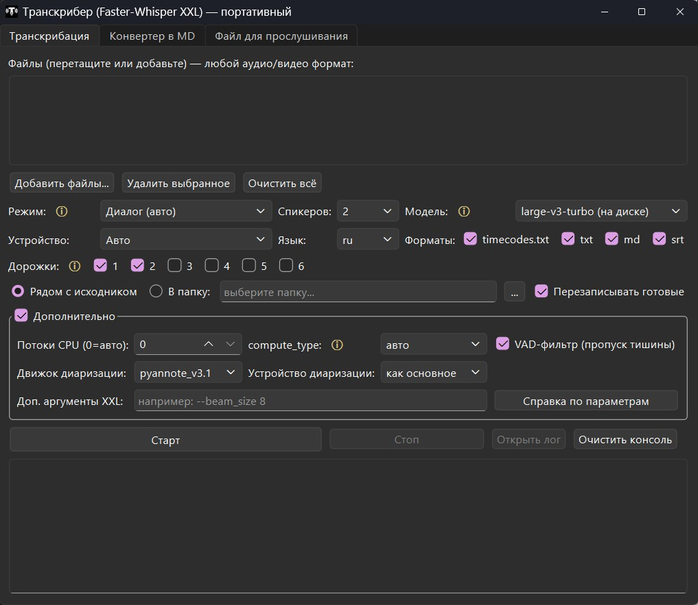
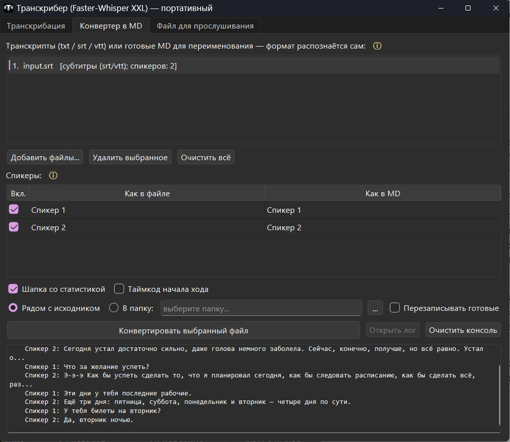
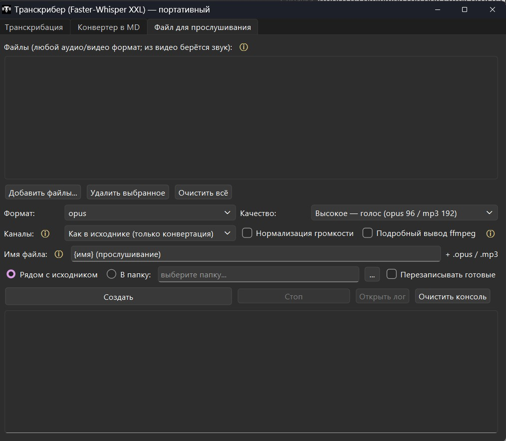

# Транскрибер XXL — портативный

Транскрибация аудио/видео с разметкой спикеров (Faster-Whisper XXL),
конвертер транскриптов в читабельный MD и конвертер «файлов для
прослушивания». Всё в одной папке: свой Python, свой ffmpeg, все модели.
Ничего не устанавливается в систему.

## Запуск

Двойной клик по **`Transcriber.exe`** — окно появится через 3–6 секунд.

Запасные варианты: `run_gui.bat` (то же самое), `run_gui_debug.bat` —
консоль останется открытой и покажет ошибку текстом, если окно не
появилось. При падениях также создаётся `crash.log` рядом с программой.



## Возможности

### Вкладка «Транскрибация»

- очередь файлов; на входе любой аудио/видео формат (из видео берётся звук);
- режимы:
  - **Диалог (авто)** — сам выбирает: несколько аудиодорожек → «Дорожки»,
    иначе → «Диаризация»;
  - **Дорожки (OBS)** — каждая дорожка = свой спикер, самый точный вариант;
  - **Стерео** — левый канал = один голос, правый = другой (рекордеры звонков);
  - **Диаризация** — обычная запись, спикеры определяются по тембрам
    (точность выше, если указать число спикеров);
  - **Без спикеров (монолог)** — подкаст/лекция: только текст, быстрее;
- модели: `large-v3-turbo` (основная), `large-v3`, **своя модель** —
  любая папка с моделью формата CTranslate2 (model.bin + config.json);
- устройство: авто (NVIDIA с 4+ ГБ видеопамяти → CUDA, иначе CPU),
  можно принудительно CPU/CUDA;
- язык: ru / en / авто; выбор дорожек для режима «Дорожки»;
- форматы результата: `timecodes.txt`, `txt`, `md`, `srt` (любой набор);
- уже обработанные файлы пропускаются — удобно перезапускать прерванную
  очередь (галочка «Перезаписывать готовые» отключает пропуск);
- «Дополнительно»: потоки CPU, точность вычислений compute_type
  (авто / int8 / int8_float16 / int8_float32 / float16 / float32 —
  у каждого пункта подсказка), VAD-фильтр тишины, движок диаризации
  (pyannote v3.0/v3.1, reverb v1/v2) и отдельное устройство для него,
  произвольные аргументы XXL + встроенная справка по всем параметрам;
- живой лог в окне + полный лог-файл в `logs\`.

### Вкладка «Конвертер в MD»



- превращает «сырой» транскрипт в читабельный MD-документ: шапка со
  статистикой (кто сколько говорил) + диалог абзацами «**Имя:** текст»;
- понимает форматы: наш транскрибер, Subtitle Edit / XXL, GigaAMGUI,
  обычные srt/vtt, диалог без таймкодов — распознаётся сам;
- переименование спикеров («Спикер 1» → «Психолог»), имена запоминаются;
  спикера можно исключить из документа (снятая галочка);
- готовый MD можно прогнать повторно, чтобы переименовать спикеров в нём.

### Вкладка «Файл для прослушивания»



- переводит записи в компактный формат для архива/прослушивания:
  часовая запись из сотен МБ → десятки МБ практически без потери качества;
- из любого видео делает небольшой аудиофайл (видеоряд отбрасывается);
- форматы: `opus` (максимум качества на килобайт) и `mp3` (открывается
  везде); пресеты качества под голос + отдельный «Максимум» для музыки;
- умеет выровнять громкость (нормализация), свести многодорожечную
  запись OBS в один файл или развести голоса по ушам.

## Перенос на другой компьютер

Скопируйте всю папку целиком — и всё. Модели и настройки едут внутри.
Требования к машине: Windows 10/11 64-bit. Ни Python, ни ffmpeg, ни токены
не нужны. Пробелы и кириллица в пути не мешают (проверено).

На машине с видеокартой NVIDIA (от 4 ГБ видеопамяти) программа сама
включит CUDA-ускорение; иначе работает на процессоре.

## Что где лежит

| Папка/файл | Что это |
|---|---|
| `Transcriber.exe` | запуск GUI (портативный лаунчер, иконка — `T.ico`) |
| `launcher.cs` | исходник лаунчера (пересборка встроенным в Windows csc) |
| `gui.py` + `run_gui.bat` | графический интерфейс |
| `transcriber.py` | движок транскрибации (можно звать из консоли) |
| `converter.py` | конвертер транскриптов в MD (тоже CLI) |
| `listening.py` | конвертер «файлов для прослушивания» (тоже CLI) |
| `xxl\` | Faster-Whisper XXL (распознавание + диаризация) |
| `xxl\_models\` | модели Whisper (докачиваются сюда по мере надобности) |
| `runtime\` | встроенный Python 3.12 (не трогать) |
| `ffmpeg\` | ffmpeg + ffprobe |
| `logs\` | лог-файлы обработок |
| `temp\` | временные файлы (чистится само) |
| `settings.json` | настройки GUI (запоминаются при закрытии) |
| `docs\` | техзадание и описание пайплайна (для доработок нейросетями) |

## Сборка среды с нуля (после git clone)

В репозитории только код (~200 КБ) — тяжёлая среда собирается скриптом:
двойной клик по **`setup.bat`** (или `powershell -ExecutionPolicy Bypass
-File setup.ps1`). Скрипт скачает и разложит по местам:

- портативный Python 3.12 + PyQt6 (python.org / pypi);
- Faster-Whisper XXL r245.4 (~1.4 ГБ, GitHub Purfview);
- ffmpeg + ffprobe (сборка BtbN, GitHub);
- соберёт `Transcriber.exe` из `launcher.cs` (компилятором из состава Windows).

Нужен интернет и ~5 ГБ свободного места; занимает 5–15 минут. Повторный
запуск безопасен: готовые компоненты пропускаются, недокачанное
докачивается. Версии зафиксированы в начале `setup.ps1`. Загрузки
удаляются автоматически после успешной сборки. Модели Whisper скрипт
не качает — они докачиваются сами при первом использовании.

## Ориентиры по скорости (Ryzen 9 3900X, CPU, модель turbo)

- распознавание: ~1x от длительности записи;
- распознавание + диаризация: ~1x (часовая запись ≈ 55–65 минут).

## Консольное использование (без GUI)

```
runtime\python.exe transcriber.py "запись.opus" --mode diarize --speakers 2
runtime\python.exe transcriber.py "запись OBS.mkv"        (авто: дорожки)
runtime\python.exe transcriber.py "подкаст.mp3" --mode plain
runtime\python.exe converter.py "транскрипт.txt"
runtime\python.exe listening.py "запись OBS.mkv" --channels stereo
```

Все параметры: `runtime\python.exe transcriber.py --help` (аналогично
для `converter.py` и `listening.py`).
